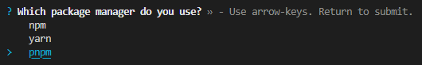
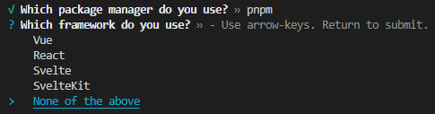
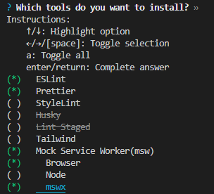

# lai-cmd

This is a command-line interface based on npx for generating web development environment.

English ｜[繁體中文](https://github.com/LaiJunBin/lai-cmd/blob/develop/README-zh-tw.md#lai-cmd)

---

## Usage:

```
$ npx lai-cmd@next init
```

### Select Package Manager


### Select Framework


### Select Tools


---

## Support Frameworks and Tools
- [x] [Vue](https://vuejs.org/)
  - [x] [ESLint](https://eslint.org/)
  - [x] [Prettier](https://prettier.io/)
  - [x] [StyleLint](https://stylelint.io/)
  - [x] [Husky (pre-commit)](https://typicode.github.io/husky/)
  - [x] [Lint-Staged](https://github.com/okonet/lint-staged)
  - [x] [Tailwind](https://tailwindcss.com/)
  - [x] [Mock Service Worker](https://mswjs.io/)
    - [x] [Browser](https://mswjs.io/docs/getting-started/integrate/browser)
    - [x] [Node](https://mswjs.io/docs/getting-started/integrate/node)
    - [x] [mswx](https://github.com/LaiJunBin/mswx)
- [x] [React](https://react.dev/)
  - [x] [ESLint](https://eslint.org/)
  - [x] [Prettier](https://prettier.io/)
  - [x] [StyleLint](https://stylelint.io/)
  - [x] [Husky (pre-commit)](https://typicode.github.io/husky/)
  - [x] [Lint-Staged](https://github.com/okonet/lint-staged)
  - [x] [Tailwind](https://tailwindcss.com/)
  - [x] [Testing-Library](https://testing-library.com/)
    - [x] Add Testing Library Example
  - [x] [Mock Service Worker](https://mswjs.io/)
    - [x] [Browser](https://mswjs.io/docs/getting-started/integrate/browser)
    - [x] [Node](https://mswjs.io/docs/getting-started/integrate/node)
    - [x] [mswx](https://github.com/LaiJunBin/mswx)
- [x] [Svelte](https://svelte.dev/)
  - [x] [ESLint](https://eslint.org/)
  - [x] [Prettier](https://prettier.io/)
  - [x] [StyleLint](https://stylelint.io/)
  - [x] [Husky (pre-commit)](https://typicode.github.io/husky/)
  - [x] [Lint-Staged](https://github.com/okonet/lint-staged)
  - [x] [Tailwind](https://tailwindcss.com/)
  - [x] [Testing-Library](https://testing-library.com/)
    - [x] Add Testing Library Example
  - [x] [Mock Service Worker](https://mswjs.io/)
    - [x] [Browser](https://mswjs.io/docs/getting-started/integrate/browser)
    - [x] [Node](https://mswjs.io/docs/getting-started/integrate/node)
    - [x] [mswx](https://github.com/LaiJunBin/mswx)
- [x] [SvelteKit](https://kit.svelte.dev/)
  - [x] [ESLint](https://eslint.org/)
  - [x] [Prettier](https://prettier.io/)
  - [x] [StyleLint](https://stylelint.io/)
  - [x] [Husky (pre-commit)](https://typicode.github.io/husky/)
  - [x] [Lint-Staged](https://github.com/okonet/lint-staged)
  - [x] [Tailwind](https://tailwindcss.com/)
  - [x] [Testing-Library](https://testing-library.com/)
    - [x] Add Testing Library Example
  - [x] [Mock Service Worker](https://mswjs.io/)
    - [x] [Browser](https://mswjs.io/docs/getting-started/integrate/browser)
    - [x] [Node](https://mswjs.io/docs/getting-started/integrate/node)
    - [x] [mswx](https://github.com/LaiJunBin/mswx)
- [x] Others (Vanilla)
  - [x] [ESLint](https://eslint.org/)
  - [x] [Prettier](https://prettier.io/)
  - [x] [StyleLint](https://stylelint.io/)
  - [x] [Husky (pre-commit)](https://typicode.github.io/husky/)
  - [x] [Lint-Staged](https://github.com/okonet/lint-staged)
  - [x] [Tailwind](https://tailwindcss.com/)
  - [x] [Mock Service Worker](https://mswjs.io/)
    - [x] [Browser](https://mswjs.io/docs/getting-started/integrate/browser)
    - [x] [Node](https://mswjs.io/docs/getting-started/integrate/node)
    - [x] [mswx](https://github.com/LaiJunBin/mswx)
